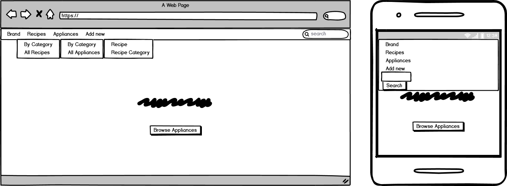
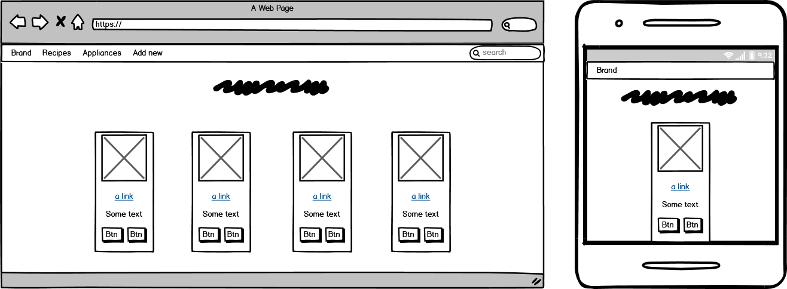
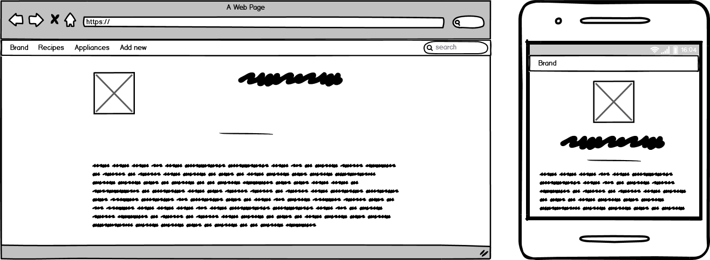
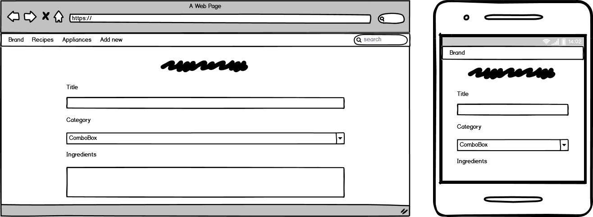

# Data-centric Development Project

[](https://travis-ci.com/faithy80/dcd-project)

The purpose of this project is to advertise branded cooking appliances via community shared food recipes on a full-stack website. The site also allows searching for the existing recipes or to share our favorite ones.

## Table of contents

* [Demo](#demo)
* [UX](#ux)
  * [Database structure](#database-structure)
  * [Wireframes](#wireframes)
* [Features](#features)
  * [Frontend features](#frontend-features)
  * [Backend features](#backend-features)
  * [Future features](#future-features)
* [User stories](#user-stories)
* [Technologies](#technologies)
  * [Languages](#languages)
  * [Libraries and frameworks](#libraries-and-frameworks)
  * [Hosting, deployment and testing](#hosting-deployment-and-testing)
* [Deployment](#deployment)
  * [Local deployment](#local-deployment)
* [Testing and validation](#testing-and-validation)
* [Credits](#credits)
  * [Content](#content)
  * [Acknowledgements](#acknowledgements)

## Demo

The live demo is hosted by Heroku. Click [here](http://dcd-project.herokuapp.com/) to open the web application.

## UX

The mobile-first approach design was implemented on this website to maintain the user experience from mobile devices to desktop computers. Bootstrap framework is responsible for the responsiveness.

### Database structure

Creating the database structure was the first step in the development. There are 4 collections in the database:

* recipes:

```txt
{
  "_id" :                 <ObjectID>,
  "title":                <string>,
  "category":             <string>,
  "ingredients":          <array of string>,
  "method":               <array of string>,
  "appliances":           <array of string>,
  "img_link":             <string>,
  "reviews":              <array of string>,
  "servings":             <integer>,
  "view_stat":            <integer>
}
```

* recipe_categories:

```txt
{
  "_id":                  <ObjectID>,
  "name":                 <string>,
  "number_of_recipes":    <integer>
}
```

* appliances:

```txt
{
  "_id":                  <ObjectID>,
  "brand":                <string>,
  "model":                <string>,
  "type":                 <string>,
  "fuel_type":            <string>,
  "colour":               <string>,
  "description":          <string>,
  "price":                <string>,
  "img_link":             <string>,
  "reviews":              <array of string>,
  "view_stat":            <integer>
}
```

* appliance_categories:

```txt
{
  "_id":                  <ObjectID>,
  "name":                 <string>,
  "number_of_appliances": <integer>
}
```

When a recipe is created, the category can only be selected from the recipe categories. Also, at least one of the appliance categories has to be added to the recipe for advertising purposes.

### Wireframes

Home page

Search page

View page

Home page


## Features

### Frontend features

* a simple landing page with a navigation bar and a footer
* browse all recipes, recipe categories, appliances and appliance categories
* browse recipes and appliances by category
* search recipes by ingredients (partial regex non-case sensitive search on the navigation bar)
* add, update and delete recipes and recipe categories
* delete confirmation script to protect the data from an accidental removal
* add reviews for recipes and appliances
* script to display remaining characters for text areas

### Backend features

* when a recipe category is updated, the application also updates the category name in every recipe in the category
* when a recipe category is deleted, the application also deletes every recipe in the category
* error handling (HTTP, no result on database query)
* add and update form validation
* the image URL in the add and the update form is tested if it is valid and the content is an image. A fallback image URL is stored in the database on error.
* view_stat increases when a recipe or an appliance is viewed
* the application counts the number of recipes in the category
* pagination for search results

### Future features

* improved search (e.g. search anything in the whole recipe, sort recipes differently in the all recipe search)
* login system to manage permissions of the users, vouchers, ...
* export a recipe to PDF
* share recipes and appliances online

## User stories

As a user, I should be able to:

* [x] browse recipes, so I can prepare a new meal following the recipe steps.
* [x] add new recipes and/or recipe categories, so I can share my favorite recipes on the website.
* [x] browse cooking appliances, so I can buy modern equipment to prepare my meal.

As an owner/developer, I should be able to:

* [x] modify existing recipes and/or recipe categories, so I can fix mistakes.
* [x] delete existing recipes and/or recipe categories, so I can remove duplicated recipes to keep the website organized.  
* [ ] add more cooking appliances and appliance categories to the database, so the users can discover more devices to buy.

The authentication system is not mandatory for this project. The user stories point out that the users on different levels should have different permission to access the database. To achieve that, a login system needs to be implemented in the future.

## Technologies

### Languages

* HTML5
* CSS3
* JavaScript  
* Python (3.6)

### Libraries and frameworks

* [Bootstrap (4.4.1)](https://getbootstrap.com/) framework for developing responsive websites
* [jQuery (3.4.1)](https://jquery.com/) library to use JavaScript easier on the website
* [Hover CSS (2.3.1)](https://ianlunn.github.io/Hover/) library to apply effects on the HTML elements
* [Fontawesome (4.7.0)](https://fontawesome.com/v4.7.0/) library for custom icons
* [Flask (1.1.2)](https://pypi.org/project/Flask/) framework to build the web application
* [Flask-Pymongo (2.3.0)](https://pypi.org/project/Flask-PyMongo/) library to connect to the MongoDB database from the web application

### Hosting, deployment and testing

* [Git](https://git-scm.com/) for version control
* [Github](https://github.com/) for code hosting
* [Heroku](https://heroku.com) for app deployment
* [Travis-CI](https://travis-ci.com/) for test deployment  
* [MongoDB](https://www.mongodb.com/) for non-relational database hosting

## Deployment

The source code of the website is deployed to Github and the web application is hosted by Heroku. They both update automatically on a new commit and push to the master branch of the Github repository. Also, a TravisCI account is linked to the Github project to test if the web application is deployed successfully.

### Local deployment

To run a web application, I am using VSCode on WSL (Windows Subsystem for Linux) in Windows 10. WSL allows me to run Ubuntu 18.04 LTS in a virtual environment making the local development very convenient. The following links may be useful to setup WSL and VScode:

* [Windows Subsystem for Linux Installation Guide for Windows 10](https://docs.microsoft.com/en-us/windows/wsl/install-win10)
* [Developing in WSL](https://code.visualstudio.com/docs/remote/wsl)
* [Run in Windows Subsystem for Linux](https://code.visualstudio.com/remote-tutorials/wsl/run-in-wsl)
* [The Ultimate Guide To Use VS Code With Windows Subsystem for Linux (WSL)](https://dev.to/ajeet/the-ultimate-guide-to-use-vs-code-with-windows-subsystem-for-linux-wsl-51hc)

After the environment is prepared, open Ubuntu 18.04 LTS application to start the Ubuntu environment. Use ```sudo apt update && sudo apt upgrade -y``` to run the update. If git and pip3 packages are not installed, use ```sudo apt install git python3-pip``` to install the missing packages. Command ```python3 --version``` returns the version number for python. Version 3.6 is required to run this application.

Use ```git clone  https://github.com/faithy80/dcd-project.git``` to clone the git repository. Also, use ```cd dcd-project/``` to change the current directory.

To restore the database, these steps should be followed:

* create a free tier account on [mongodb.com](https://www.mongodb.com/)
* build a new cluster
* add an admin user in the Database Access menu. This step allows accessing the database.
* add 0.0.0.0/0 to the IP whitelist in the Network Access menu. This step allows accessing the MongoDB server from any IP addresses.
* run ```mongorestore --host <host_name> --ssl --username <root_username> --password <password> --authenticationDatabase admin``` from the root folder of the git archive (dcd-project). The proper command with the hostname can be found in the Clusters/Command Line Tools menu at mongoDB.com. If the mongorestore command is not available, use ```sudo apt install mongo-tools``` to install.

The last step of the local deployment is to set the environmental variables to gain access to the database from the web application.
Use ```export MONGO_URI="<mongoDB_uri>"``` and ```export MONGO_DBNAME="<database_name>"``` commands. The ```<mongoDB_uri>``` can be found in the Clusters/Connect/Connect your application menu on the MongoDB server. Choose Python 3.6 or above to get the correct connection string. If the database was restored from the backup I provided, the ```<database_name>``` will be 'myTestDB'. If we add the export commands to the .bashrc file in the home directory, the variables will be set each time the environment is started. To edit the .bashrc file, use ```nano ~/.bashrc``` command. Place the export commands to the bottom of the file. Use CTRL + O to save the file and CTRL + X to exit the text editor.

After all these steps, we can start VSCode using the ```code .``` command. The dot represents the current directory. To start the application, we need to open run.py in the editor window and start the script using the little green 'play' button in the top right corner.

## Testing and validation

The website was tested manually to ensure compatibility and functionality across all types of devices. The site was also tested for responsiveness to display the content properly on mobile devices. Every functionality was tested thoroughly.

The python source code was linted and formatted to the PEP-8 standard and it was tested at [pep8online.com](http://pep8online.com/). The HTML and CSS code was tested at [W3 Markup Validation Service](https://validator.w3.org/) and [W3 CSS validation Service](https://jigsaw.w3.org/css-validator/validator.html.en). Unfortunately, the Markup Validation Service does not recognize jinja2 templates, so the rendered code had to be validated.

As a part of the defensive design, the web application has both frontend and backend limitations. The input fields and the text areas have a certain limit to avoid spamming the database. The 'servings' key in the 'recipes' collection is an integer type, so the frontend takes a number as a value and the backend makes sure that the frontend validation is not manipulated from the Chrome developer tools. The image URL has to be validated during the add and the update process. It is tested for validity and content type. If the URL is not valid or it is not an image, the backend replaces it with a URL of a fallback image. Every input field and text area tag has the required attribute to avoid sending an empty or partially filled form to add or update in the database. The backend also has the option to reject the empty variables in the form validation.

## Credits

### Content

The contents were taken from the following websites:

* The recipes from [allrecipes.com](https://www.allrecipes.com/)
* The appliances from [harveynorman.ie](https://www.harveynorman.ie/)
* Bootstrap 4 cards from [Bootstrap website](https://getbootstrap.com/docs/4.0/components/card/)
* Bootstrap 4 carousel from [Bootstrap website](https://getbootstrap.com/docs/4.0/components/carousel/)
* Bootstrap 4 forms from [Bootstrap website](https://getbootstrap.com/docs/4.0/components/forms/)
* Pagination from [Youtube.com](https://www.youtube.com/watch?v=Lnt6JqtzM7I)
* Characters remaining counter from [Youtube.com](https://www.youtube.com/watch?v=X-LVkU95jLU)

Only for educational purposes.

### Acknowledgements

I'd like to thank

* Mentor Matt Rudge and Neil Mc Even for the tutorials
* Mentor Brian Macharia for his advice and guiding me through this project
* Haley Schafer for the README example
